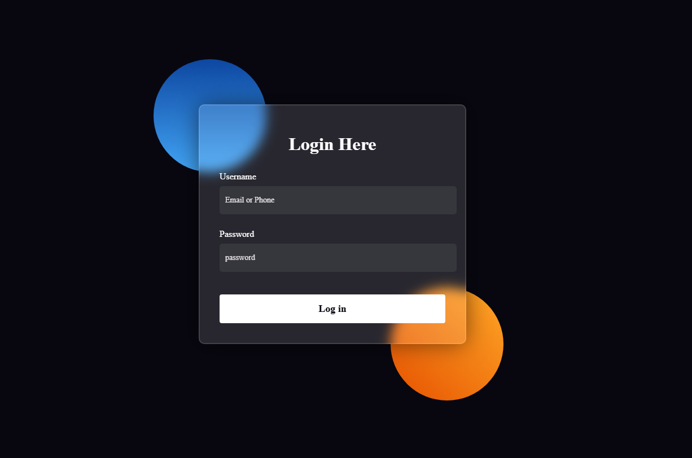

# 🔐 Login Form UI

A modern and responsive login form design built with **HTML** and **CSS**.

This project focuses on creating a beautiful glassmorphism login interface using CSS styling techniques, gradients, and modern UI design principles.

---

## ✨ Features

- 🔐 Modern Login Form Interface
- 🎨 Glassmorphism Design
- 🌈 Gradient Background Shapes
- 📱 Responsive Layout
- ✨ Blur Effects Using Backdrop Filter
- 🖱️ Styled Input Fields and Button
- 🌑 Dark Theme User Interface

---

## 🛠️ Technologies Used

- HTML5
- CSS3

### CSS Concepts Practiced

- Flexbox Layout
- Positioning
  - Relative
  - Absolute
- Linear Gradients
- Border Radius
- Box Shadow
- Backdrop Filter
- Transparent Backgrounds
- CSS Pseudo Elements
- Form Styling
- Input and Button Customization

---

## 📸 Screenshots

### Login Form

---
